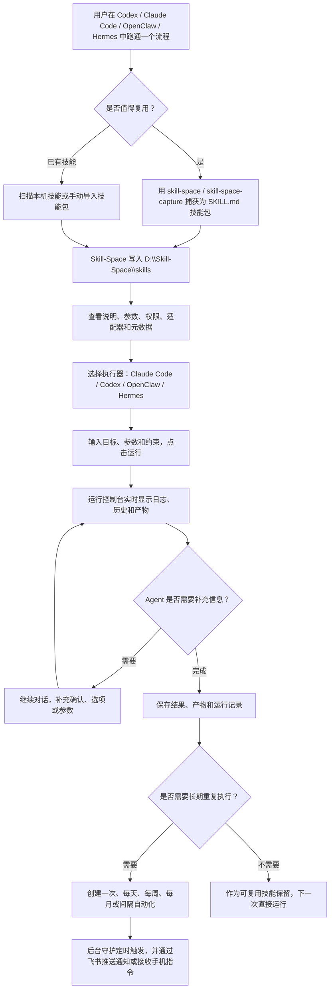

# Skill-Space

> 本地优先的 SkillOps 桌面工作台。把 Codex、Claude Code、OpenClaw、Hermes Agent 等 AI Agent 中可复用的工作流沉淀为通用 `SKILL.md` 技能，并统一管理、运行、对话、飞书协同和定时自动化。
>
> A local-first SkillOps desktop workspace for turning reusable AI-agent workflows into portable `SKILL.md` skills, then managing, running, continuing, scheduling, and coordinating them through a visual app.

<p align="center">
  
</p>

<p align="center">
  <a href="https://github.com/lj1270998580-crypto/Skill-Space/releases/latest">Windows 安装包 / Windows Installer</a>
  ·
  <a href="AGENT_INSTALL.md">Agent 安装指南 / Agent Install Guide</a>
  ·
  <a href="docs/skill-space-blueprint.md">产品蓝图 / Blueprint</a>
</p>

<p align="center">
  
  
  
  
</p>

---

## 中文

### 当前版本

- 最新版本：`0.1.5`
- Release：<https://github.com/lj1270998580-crypto/Skill-Space/releases/tag/v0.1.5>
- Windows 安装包：<https://github.com/lj1270998580-crypto/Skill-Space/releases/download/v0.1.5/Skill-Space-Setup-0.1.5-x64.exe>
- 在线更新源：<https://ailabing.cn/downloads/skill-space/latest.yml>
- 默认数据目录：`D:\Skill-Space`
- 默认执行器：Claude Code
- 默认权限模式：个人本地使用，`full`

### 简介

Skill-Space 是一个面向个人自动化工作流的本地桌面应用。它解决的问题很直接：当你在 Codex、Claude Code、OpenClaw、Hermes Agent 或其他 Agent 中完成了一套可复用流程后，可以把它保存成通用 `SKILL.md` 技能包，再通过 Skill-Space 查看、分类、运行、继续对话、定时触发和远程协同。

应用默认中文界面，设置中支持英文。技能、运行历史、日志、产物、自动化任务、LLM 配置和飞书配置都优先保存在本机。

### 0.1.5 重点

- LLM 管家支持连续对话，并会记住最近几轮上下文。
- 飞书消息支持 LLM 意图识别和最近对话上下文，不再只依赖固定 `/skill` 模板。
- 深色模式下 LLM 管家对话框可读性已优化。
- 顶栏更新检查会显示明确状态反馈。
- 支持在线更新，安装版可从阿里云更新源检测新版本。
- 支持 GitHub Releases 下载 `0.1.5` 安装包。

### 工作流程



### 核心功能

| 模块 | 能力 |
| --- | --- |
| 总览 | 查看本地技能工作台、最近技能，并和 LLM 管家连续对话 |
| 技能库 | 扫描电脑已有技能、手动导入技能、收藏、搜索、单标签分类 |
| 技能详情 | 查看 `SKILL.md`、`workflow.yaml`、权限、适配器、最近变更和应用显示名 |
| 工作流捕获 | 使用内置 `skill-space` / `skill-space-capture` 技能，把可复用工作流生成新技能 |
| 多 Agent 执行 | 支持 Claude Code、Codex CLI、OpenClaw、Hermes Agent 等执行器 |
| 运行控制台 | 查看实时日志、运行历史、运行产物，并支持继续对话 |
| 自动化 | 支持一次、每天、每周、每月和间隔触发 |
| 后台守护 | 通过 Windows Task Scheduler 静默检查定时任务，避免弹出命令窗口 |
| 飞书通信 | 支持扫码连接或手动配置，显示连接状态，推送运行状态，接收远程指令 |
| 飞书 LLM 调度 | 手机飞书自然语言消息可由 LLM 判断意图，查看状态、列技能或启动技能 |
| LLM 管家 | 支持 Claude Code、OpenAI、DeepSeek、通义千问、Kimi、Gemini、智谱、豆包、SiliconFlow、OpenRouter、Groq、LM Studio、vLLM、Ollama 和兼容接口 |
| 在线更新 | 顶栏检查更新，支持下载并安装新版本 |
| 双语界面 | 默认中文，设置中可切换英文 |
| Liquid Glass UI | 类苹果液态玻璃视觉风格，支持深色/浅色主题 |

### 安装方式

#### 方式一：下载 Windows 安装包

从最新 Release 下载并安装：

```text
https://github.com/lj1270998580-crypto/Skill-Space/releases/latest
```

当前直链：

```text
https://github.com/lj1270998580-crypto/Skill-Space/releases/download/v0.1.5/Skill-Space-Setup-0.1.5-x64.exe
```

安装后会创建：

- 应用目录：`%LOCALAPPDATA%\Programs\Skill-Space`
- 桌面快捷方式：`Skill-Space.lnk`
- 开始菜单快捷方式：`Skill-Space`
- 卸载入口：`Skill-Space 0.1.5`

#### 方式二：让 Agent 通过 GitHub 地址安装

把仓库地址交给 Agent，并让它执行：

```powershell
git clone https://github.com/lj1270998580-crypto/Skill-Space.git D:\Skill-Space\source\Skill-Space
cd D:\Skill-Space\source\Skill-Space
powershell -NoProfile -ExecutionPolicy Bypass -File .\scripts\install-from-github.ps1 -RepoUrl https://github.com/lj1270998580-crypto/Skill-Space.git
```

脚本会：

- 安装 npm 依赖；
- 生成 Windows `.exe` 安装包；
- 可选静默安装应用；
- 安装内置技能 `skill-space` 和 `skill-space-capture`；
- 将技能同步到常见 Agent 技能目录；
- 如果 WSL 可用，尝试同步到 WSL 内的常见技能目录。

更多参数见 [AGENT_INSTALL.md](AGENT_INSTALL.md)。

### 在线更新

安装版会读取内置更新源：

```text
https://ailabing.cn/downloads/skill-space/
```

顶栏云朵按钮用于检查更新。无论有无新版本，都会显示检查状态。当前更新文件包括：

- `latest.yml`
- `Skill-Space-Setup-0.1.5-x64.exe`
- `Skill-Space-Setup-0.1.5-x64.exe.blockmap`

### LLM 管家

LLM 管家是 Skill-Space 内置的应用助手。它的职责是理解应用状态，而不是替代执行器直接完成所有任务。

它可以：

- 分析技能库和运行历史；
- 解释失败原因和下一步；
- 建议哪些技能适合自动化；
- 生成技能说明和单标签分类；
- 为飞书消息判断用户意图；
- 在总览页进行连续对话。

支持的接口包括：

```text
Claude Code, OpenAI, DeepSeek, Qwen, Kimi, Gemini, Zhipu GLM,
Volcengine Ark / Doubao, SiliconFlow, OpenRouter, Groq,
LM Studio, vLLM, Ollama, OpenAI-compatible APIs
```

### 飞书通信

Skill-Space 使用飞书/Lark 官方 Node SDK 接入企业自建应用能力。当前实现包括：

- 飞书独立页面显示状态：已关闭、未配置、连接中、已连接或异常。
- 支持扫码创建/授权应用，也支持手动保存 `App ID`、`App Secret` 和接收人/群 ID。
- 使用 Electron `safeStorage` 优先加密保存 `App Secret` 到本机配置。
- 运行开始、完成、失败、等待确认时向飞书发送通知。
- 支持在飞书发送 `/skill list`、`/skill status`、`/skill run <技能ID或名称> <输入>`。
- 支持自然语言消息，由 LLM 管家理解意图并调度技能。
- 当 Agent 等待确认时，可直接在手机飞书回复 `1`、`确认` 或补充信息。

飞书权限、机器人可见范围、事件订阅和长连接能力仍需在飞书开放平台侧按企业策略开启。

### 内置技能

| 技能 | 用途 |
| --- | --- |
| `skill-space` | 将 Codex、Claude Code、OpenClaw、Hermes Agent 中的可复用工作流发布到 Skill-Space |
| `skill-space-capture` | 将已完成或用户描述的工作流转换为便携 `SKILL.md` 技能包 |

安装脚本会把它们复制到：

```text
D:\Skill-Space\skills
%USERPROFILE%\.codex\skills
%USERPROFILE%\.agents\skills
%USERPROFILE%\.claude\skills
%USERPROFILE%\.openclaw\skills
```

如果 WSL 可用，也会尝试复制到：

```text
~/.codex/skills
~/.agents/skills
~/.claude/skills
~/.openclaw/skills
~/.hermes/skills
```

### 技能包规范

Skill-Space 兼容以 `SKILL.md` 为入口的通用技能包。推荐结构：

```text
my-skill/
  SKILL.md
  scripts/
  references/
  assets/
  agents/
    openai.yaml
  .skillspace/
    manifest.json
    workflow.yaml
    inputs.schema.json
    outputs.schema.json
    permissions.json
    adapters.json
```

`SKILL.md` 是通用入口，`.skillspace/` 存放 Skill-Space 可视化和调度元数据。这样技能仍可被 Codex、Claude Code、OpenClaw、Hermes 和其他只理解 `SKILL.md` 的 Agent 使用。

### 本地数据目录

默认数据根目录：

```text
D:\Skill-Space\
  skills\        技能库
  imports\       导入缓存
  runs\          运行历史和日志
  artifacts\     运行产物
  automations\   定时任务和后台守护脚本
  logs\          应用日志
  config\        本地配置，含 LLM 和飞书配置
  registry\      注册表和索引
```

### 开发

环境要求：

- Windows 10/11
- Node.js 18+
- npm
- 可选：`claude`、`codex`、`openclaw`、Hermes Agent 等 CLI

常用命令：

```powershell
npm install
npm run dev
npm run typecheck
npm run build
npm run dist:win
```

安装包输出：

```text
release\Skill-Space-Setup-0.1.5-x64.exe
```

### 常见问题

**这是本地应用还是云应用？**  
这是本地优先应用。默认数据放在 `D:\Skill-Space`，不会依赖云端数据库。

**安装包是否已经包含技能？**  
包含。安装包内置 `skill-space` 和 `skill-space-capture`，安装脚本也会把它们同步到常见 Agent 技能目录。

**为什么运行技能时还需要 Claude Code 或 Codex？**  
Skill-Space 是技能管理和调度层，实际执行仍由你选择的 Agent CLI 完成。

**是否支持需要确认步骤的技能？**  
支持。运行页提供“继续对话”，飞书也可以在任务等待确认时继续回复。

**LLM 管家会记住上下文吗？**  
会。桌面总览页会保留最近对话，飞书也会保留最近消息上下文用于意图判断。

---

## English

### Current Release

- Latest version: `0.1.5`
- Release: <https://github.com/lj1270998580-crypto/Skill-Space/releases/tag/v0.1.5>
- Windows installer: <https://github.com/lj1270998580-crypto/Skill-Space/releases/download/v0.1.5/Skill-Space-Setup-0.1.5-x64.exe>
- Online update feed: <https://ailabing.cn/downloads/skill-space/latest.yml>
- Default data root: `D:\Skill-Space`
- Default runtime: Claude Code

### Overview

Skill-Space is a local-first desktop app for personal AI workflow automation. It turns reusable work done in Codex, Claude Code, OpenClaw, Hermes Agent, or compatible CLIs into portable `SKILL.md` packages, then provides a visual workspace for managing, running, continuing, scheduling, and remotely coordinating those skills.

The UI defaults to Simplified Chinese and can be switched to English in Settings. Skills, run history, logs, artifacts, schedules, LLM configuration, and Feishu configuration are stored locally by default.

### What's New In 0.1.5

- Continuous conversation memory for the dashboard LLM steward.
- Feishu/Lark messages now include recent conversation context for LLM intent routing.
- Improved dark-mode readability for the LLM steward chat.
- Consistent dashboard action button sizing.
- Online update metadata and GitHub Release assets published for `0.1.5`.

### Highlights

| Area | Capability |
| --- | --- |
| Dashboard | Local SkillOps overview, recent skills, and continuous LLM steward chat |
| Skill Library | Scan local skills, import packages, inspect `SKILL.md`, metadata, permissions, and adapters |
| Workflow Capture | Convert reusable agent workflows into portable skills |
| Multi-Agent Runs | Run the same skill with Claude Code, Codex CLI, OpenClaw, Hermes Agent, or compatible CLIs |
| Run Console | View live logs, history, artifacts, and continue interactive runs |
| Automation | Schedule one-time, daily, weekly, monthly, or interval-based runs |
| Background Scheduler | Use Windows Task Scheduler silently without command-window popups |
| Feishu Messaging | Connect a Feishu/Lark self-built bot, send run notifications, receive confirmations, and accept remote commands |
| Feishu LLM Routing | Let the LLM steward understand natural-language mobile messages and route them to skills |
| LLM Steward | Supports Claude Code, OpenAI, DeepSeek, Qwen, Kimi, Gemini, Zhipu, Doubao, SiliconFlow, OpenRouter, Groq, LM Studio, vLLM, Ollama, and compatible APIs |
| Online Update | Check, download, and install updates from the desktop app |
| Bilingual UI | Chinese by default, English optional |
| Liquid Glass UI | Electron + React interface with translucent panels and light/dark themes |

### Installation

Download the latest Windows installer:

```text
https://github.com/lj1270998580-crypto/Skill-Space/releases/latest
```

Current direct asset:

```text
https://github.com/lj1270998580-crypto/Skill-Space/releases/download/v0.1.5/Skill-Space-Setup-0.1.5-x64.exe
```

Installed app location:

```text
%LOCALAPPDATA%\Programs\Skill-Space
```

### Agent Installation From GitHub

Give an agent the repository URL and ask it to run:

```powershell
git clone https://github.com/lj1270998580-crypto/Skill-Space.git D:\Skill-Space\source\Skill-Space
cd D:\Skill-Space\source\Skill-Space
powershell -NoProfile -ExecutionPolicy Bypass -File .\scripts\install-from-github.ps1 -RepoUrl https://github.com/lj1270998580-crypto/Skill-Space.git
```

The script installs dependencies, builds the Windows installer, optionally runs it, and installs the bundled `skill-space` and `skill-space-capture` skills into common agent skill roots.

See [AGENT_INSTALL.md](AGENT_INSTALL.md) for details.

### Online Updates

Installed builds use this generic update feed:

```text
https://ailabing.cn/downloads/skill-space/
```

Use the cloud button in the top bar to check for updates. The app shows feedback whether an update exists or not.

### Feishu / Lark Messaging

Skill-Space integrates with the official Feishu/Lark Node SDK for self-built bot apps. The Feishu page can show connection state, start QR-code registration, save manual app credentials, send test messages, push run lifecycle updates, accept `/skill` commands, and route natural-language mobile messages through the LLM steward.

Secrets are stored locally and encrypted with Electron `safeStorage` when available. Feishu-side scopes, bot visibility, event subscription, and long-connection permissions must still be enabled in the Feishu Open Platform console.

### Skill Package Convention

Recommended package layout:

```text
my-skill/
  SKILL.md
  scripts/
  references/
  assets/
  agents/
    openai.yaml
  .skillspace/
    manifest.json
    workflow.yaml
    inputs.schema.json
    outputs.schema.json
    permissions.json
    adapters.json
```

`SKILL.md` is the portable entrypoint. Skill-Space-specific metadata lives under `.skillspace/`.

### Development

```powershell
npm install
npm run dev
npm run typecheck
npm run build
npm run dist:win
```

The installer is generated at:

```text
release\Skill-Space-Setup-0.1.5-x64.exe
```

### Notes

Skill-Space is currently optimized for a single-user local Windows environment. The default permission mode is intentionally broad for personal automation experiments. Review each skill's permission and execution commands before using it on shared or sensitive machines.
