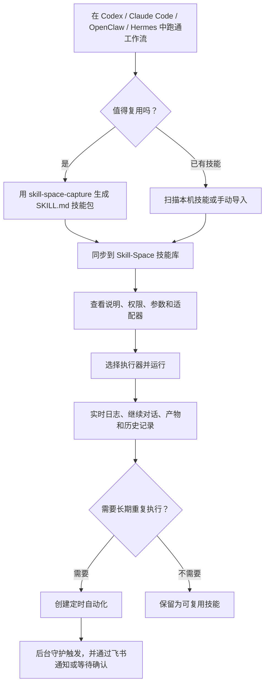

# Skill-Space

> 本地优先的 SkillOps 桌面工作台。把 Codex、Claude Code、OpenClaw、Hermes Agent 等 AI Agent 中可复用的工作流沉淀为通用 `SKILL.md` 技能，并统一管理、运行、对话、定时和移动端协同。
>
> A local-first SkillOps desktop workspace for turning reusable AI-agent workflows into portable `SKILL.md` skills, then managing, running, continuing, scheduling, and coordinating them visually.

<p align="center">
  
</p>

<p align="center">
  
  
  
  
</p>

<p align="center">
  <a href="https://github.com/lj1270998580-crypto/Skill-Space/releases/latest">Windows 安装包 / Windows Installer</a>
  ·
  <a href="AGENT_INSTALL.md">Agent 安装指南 / Agent Install Guide</a>
  ·
  <a href="docs/skill-space-blueprint.md">产品蓝图 / Blueprint</a>
</p>

---

## 中文

### 当前版本

- 最新版本：`0.1.17`
- GitHub Release：<https://github.com/lj1270998580-crypto/Skill-Space/releases/tag/v0.1.17>
- Windows 安装包：<https://github.com/lj1270998580-crypto/Skill-Space/releases/download/v0.1.17/Skill-Space-Setup-0.1.17-x64.exe>
- 在线更新源：<https://ailabing.cn/downloads/skill-space/latest.yml>
- 默认执行器：Claude Code
- 默认权限模式：个人本地使用，`full`

### 0.1.17 更新重点

- 新增工作流模板库：可在线刷新、安装通用模板，并显示本地安装状态。
- 本地技能支持“加入工作流库”，生成去本机化后的模板包和运行必填配置。
- 工作流库支持本地模板删除、分享包生成，以及服务器 `catalog.json` 在线浏览。
- 安装模板时默认安装到本地技能库目录，用户只需要填写 API、账号、服务等运行配置。
- 优化工作流库、智能体和窄窗口布局，减少卡片挤压与文字溢出。
- 继续保留 LLM 管家、飞书协同、后台定时守护、在线更新和路径安全校验。

### 核心能力

| 模块 | 能力 |
| --- | --- |
| 总览 | 查看本地技能工作台、最近技能，并和 LLM 管家连续对话 |
| 技能库 | 扫描电脑已有技能、手动导入、收藏、搜索、单标签分类 |
| 工作流库 | 在线浏览可复用模板、安装模板、查看安装状态、删除本地模板和生成分享包 |
| 技能详情 | 查看 `SKILL.md`、workflow、权限、适配器、最近变更和运行入口 |
| LLM 修改技能 | 在 `SKILL.md` 下方让 LLM 管家按要求修改技能说明和流程 |
| 多 Agent 执行 | 支持 Claude Code、Codex CLI、OpenClaw、Hermes Agent 等执行器 |
| 运行控制台 | 查看实时日志、运行历史、运行产物，并支持 Claude Code 继续对话 |
| 自动化 | 支持一次、每天、每周、每月和间隔触发 |
| 后台守护 | 通过 Windows Task Scheduler 静默检查到期任务，并在 UI 显示状态和错误 |
| 飞书通信 | 接收运行状态、远程发送任务、回复确认选项，并可接入 LLM 管家理解意图 |
| 在线更新 | 从 `ailabing.cn` 的通用更新源检查、下载和安装新版 |

### 工作流



### 安装

#### 普通用户

1. 打开 [GitHub Releases](https://github.com/lj1270998580-crypto/Skill-Space/releases/latest)。
2. 下载 `Skill-Space-Setup-0.1.17-x64.exe`。
3. 运行安装包，安装完成后从桌面或开始菜单打开 Skill-Space。

#### Agent 自动安装

把仓库地址交给 Agent：

```text
https://github.com/lj1270998580-crypto/Skill-Space
```

Agent 可参考 [AGENT_INSTALL.md](AGENT_INSTALL.md) 完成源码构建、安装包安装和内置技能同步。

### 本地存储

Skill-Space 默认优先使用本机数据目录。你可以在设置页修改本地存储根目录。保存后，应用会尝试把旧目录中的技能、运行记录、日志、自动化和配置迁移到新目录。

典型目录结构：

```text
Skill-Space/
  skills/
  runs/
  logs/
  artifacts/
  automations/
  registry/
  config/
```

### 开发

```powershell
git clone https://github.com/lj1270998580-crypto/Skill-Space.git
cd Skill-Space
npm install
npm run dev
```

常用命令：

```powershell
npm run typecheck
npm run build
npm run dist:win
```

### 发布

Windows 安装包和在线更新文件由 `electron-builder` 生成：

```text
release/Skill-Space-Setup-0.1.17-x64.exe
release/Skill-Space-Setup-0.1.17-x64.exe.blockmap
release/latest.yml
```

在线更新源目录：

```text
https://ailabing.cn/downloads/skill-space/
```

---

## English

### Current Version

- Latest version: `0.1.17`
- GitHub Release: <https://github.com/lj1270998580-crypto/Skill-Space/releases/tag/v0.1.17>
- Windows installer: <https://github.com/lj1270998580-crypto/Skill-Space/releases/download/v0.1.17/Skill-Space-Setup-0.1.17-x64.exe>
- Auto-update feed: <https://ailabing.cn/downloads/skill-space/latest.yml>
- Default runner: Claude Code
- Default permission mode: local personal use, `full`

### What's New In 0.1.17

- Added the Workflow Template Library with online refresh, install status, and reusable template install.
- Local skills can be prepared as generic workflow templates with required runtime configuration.
- Local templates can be deleted from the library or exported as share packages.
- Template install now uses the local skill library path automatically and only asks for runtime configuration such as APIs, accounts, and service options.
- Improved marketplace, agent, and narrow-window layouts to reduce text overflow and cramped controls.
- Kept the LLM steward, Feishu collaboration, background scheduler, online updater, and path safety checks.

### Features

| Area | Capability |
| --- | --- |
| Dashboard | Local SkillOps overview, recent skills, and persistent LLM steward chat |
| Skills | Scan local skills, import packages, search, favorite, and classify by one tag |
| Workflow Library | Browse online templates, install reusable workflows, see install status, delete local templates, and export share packages |
| Details | Inspect `SKILL.md`, workflow, schemas, permissions, adapters, and recent changes |
| LLM Skill Editing | Ask the steward to revise the selected `SKILL.md` directly |
| Multi-Agent Runtime | Run skills with Claude Code, Codex CLI, OpenClaw, Hermes Agent, or compatible runners |
| Run Console | Live logs, run history, artifacts, and Claude Code follow-up conversations |
| Automation | One-time, daily, weekly, monthly, and interval schedules |
| Background Scheduler | Silent Windows Task Scheduler integration with visible status and error reporting |
| Feishu Messaging | Mobile notifications, remote task commands, confirmation replies, and LLM intent routing |
| Online Updates | Generic update feed hosted on `ailabing.cn` |

### Install

1. Open [GitHub Releases](https://github.com/lj1270998580-crypto/Skill-Space/releases/latest).
2. Download `Skill-Space-Setup-0.1.17-x64.exe`.
3. Run the installer and launch Skill-Space from the desktop or Start Menu.

### Development

```powershell
git clone https://github.com/lj1270998580-crypto/Skill-Space.git
cd Skill-Space
npm install
npm run dev
```

Build and package:

```powershell
npm run typecheck
npm run build
npm run dist:win
```

## License

Apache-2.0. See [LICENSE](LICENSE).
