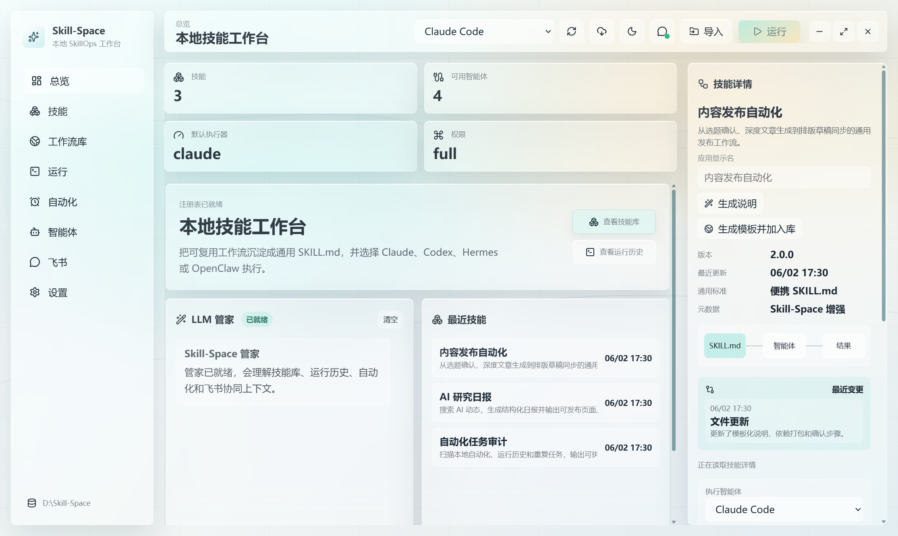
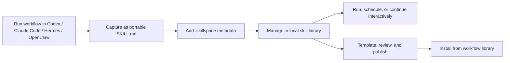
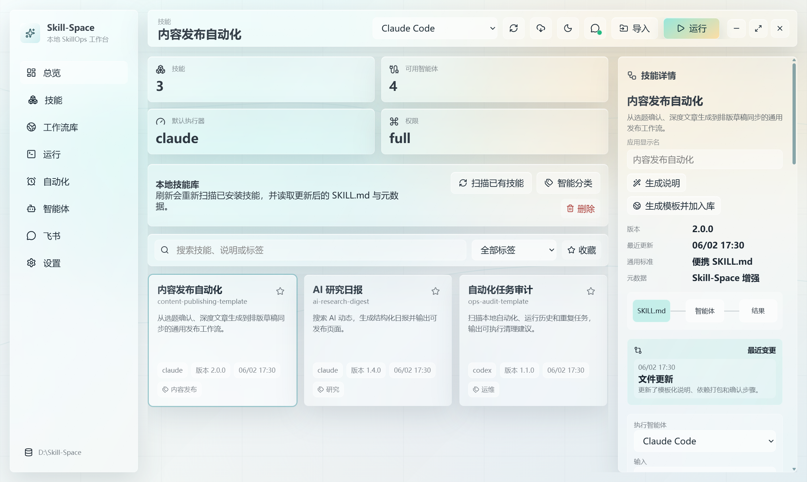
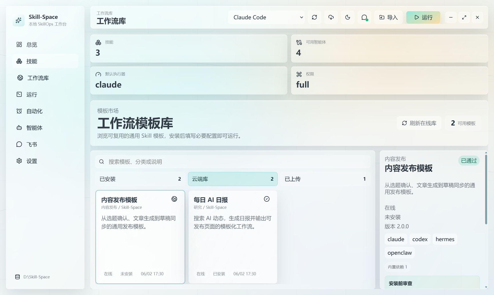
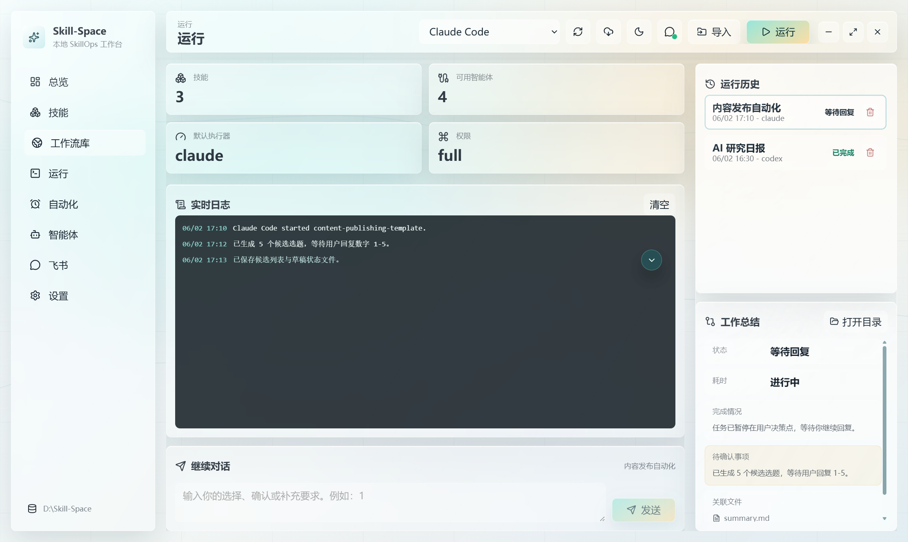
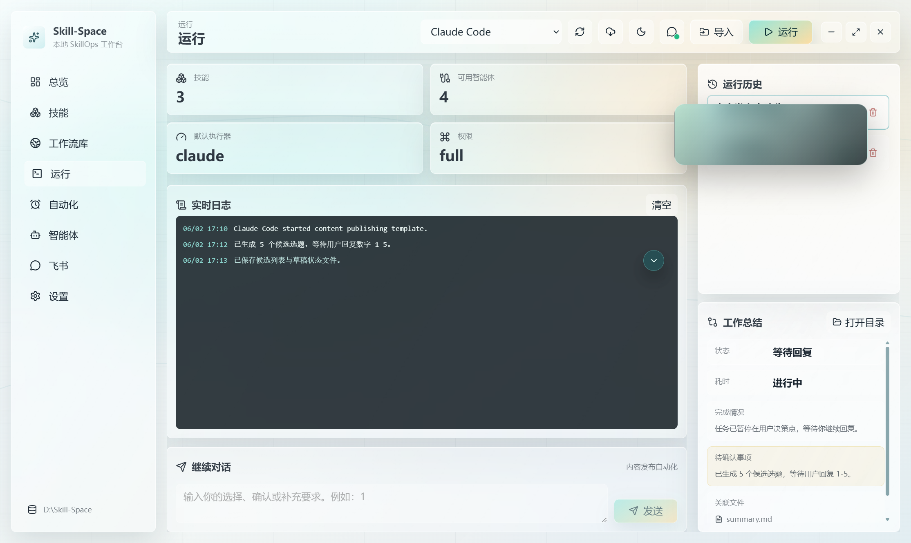

# Skill-Space

> 中文：一个本地优先的 SkillOps 桌面工作台，把 Codex、Claude Code、Hermes Agent、OpenClaw 等 Agent 工作流沉淀成可复用、可管理、可调度、可分享的通用 `SKILL.md` 技能。  
> English: A local-first SkillOps desktop workspace that turns Codex, Claude Code, Hermes Agent, OpenClaw, and other agent workflows into reusable, manageable, schedulable, and shareable universal `SKILL.md` skills.



> 中文：截图使用脱敏演示数据；涉及公众号、网站、账号或业务名的位置已使用玻璃遮罩处理。  
> English: Screenshots use anonymized demo data; public-account, website, account, and business-name areas are masked with glass overlays.

## What It Is / 项目定位

> 中文：Skill-Space 不是另一个聊天窗口，而是给本地 AI Agent 工作流做“资产化管理”的桌面应用。  
> English: Skill-Space is not another chat window; it is a desktop app for turning local AI-agent workflows into durable workflow assets.

> 中文：你可以把一次成功的 Agent 工作流捕获成标准 `SKILL.md`，补充 `.skillspace/` 元数据，在本地技能库中查看、运行、定时、通过飞书确认，并进一步发布成可复用模板。  
> English: You can capture a successful agent workflow as a standard `SKILL.md`, enrich it with `.skillspace/` metadata, view, run, schedule, confirm via Feishu/Lark, and publish it as a reusable template.

## Product Flow / 产品流程



> 中文：核心原则是 `SKILL.md` 兼容优先，Skill-Space 只在 `.skillspace/` 中增加可视化、调度、依赖、安装配置和模板发布信息。  
> English: The core rule is `SKILL.md` compatibility first; Skill-Space only adds visualization, scheduling, dependency, install-config, and template-publishing metadata under `.skillspace/`.

## Feature Demo / 功能演示

### Dashboard / 总览


> 中文：总览页展示技能数量、可用智能体、默认执行器、最近技能、LLM 管家和关键状态。  
> English: The dashboard shows skill count, available agents, default executor, recent skills, the LLM steward, and important status signals.

> 中文：LLM 管家会理解技能库、运行历史、自动化计划和飞书协同上下文，用来解释、分析、辅助调度和修改技能。  
> English: The LLM steward understands the skill library, run history, automation plans, and Feishu/Lark context to explain, analyze, route, and help edit skills.

### Skill Library / 技能库



> 中文：技能库支持扫描、导入、删除、收藏、自定义显示名、单标签分类、变更记录和 `SKILL.md` 文件查看。  
> English: The skill library supports scanning, importing, deleting, favorites, custom display names, single-label classification, change history, and `SKILL.md` inspection.

> 中文：技能详情右侧可以直接选择执行智能体并运行，也可以生成说明、让 LLM 管家协助修改技能内容。  
> English: The right detail panel lets you choose an executor and run the skill, generate a plain-language summary, or ask the LLM steward to edit the skill.

### Workflow Library / 工作流库



> 中文：工作流库分为“已安装、云端库、已上传”，用于浏览、安装、上传和删除可复用模板。  
> English: The workflow library is split into Installed, Cloud Library, and Uploaded so users can browse, install, upload, and delete reusable templates.

> 中文：发布模板前会把个人路径、密钥、账号和业务名替换为变量，并把依赖技能并入模板包，避免跨设备无法运行。  
> English: Before publishing, personal paths, secrets, account names, and business names are converted into variables, while dependent skills are bundled so templates work across machines.

### Run Console / 运行控制台



> 中文：运行页聚合实时日志、运行历史、继续对话和工作总结。需要用户确认时任务会暂停，不会默认自动通过。  
> English: The run console combines live logs, run history, follow-up input, and a structured work summary. Confirmation-required tasks pause instead of auto-approving.

> 中文：日志区支持一键到底；完成后工作总结会展示状态、耗时、完成情况、失败原因、待确认事项和关联文件。  
> English: The log area supports jump-to-bottom; after completion, the summary shows status, duration, completion details, failure reasons, pending confirmations, and related files.

### Feishu / Lark Collaboration / 飞书协同



> 中文：飞书模块支持扫码/手动配置、连接状态、消息送达状态、移动端任务指令、确认回复和卡片式结果通知。  
> English: The Feishu/Lark module supports QR/manual setup, connection status, delivery state, mobile task commands, confirmation replies, and card-style result notifications.

> 中文：移动端消息会先交给 LLM 管家理解，再判断是日常对话、运行指令、状态查询还是对等待任务的确认。  
> English: Mobile messages are first interpreted by the LLM steward, which decides whether they are casual chat, run commands, status queries, or confirmations for waiting tasks.

## Core Capabilities / 核心能力

| Module / 模块 | What It Does / 能力说明 |
| --- | --- |
| Skill Capture / 技能捕获 | 中文：把已完成或用户描述的 Agent 工作流转为通用 `SKILL.md`。<br/>English: Converts completed or user-described agent workflows into universal `SKILL.md` skills. |
| Metadata Layer / 元数据层 | 中文：用 `.skillspace/manifest.json`、`workflow.yaml`、`permissions.json` 等描述可视化、权限、输入输出和适配器。<br/>English: Uses `.skillspace/manifest.json`, `workflow.yaml`, `permissions.json`, and related files to describe visualization, permissions, I/O, and adapters. |
| Multi-Agent Runtime / 多智能体执行 | 中文：支持 Claude Code、Codex CLI、Hermes Agent、OpenClaw，也支持添加和检测本机智能体。<br/>English: Supports Claude Code, Codex CLI, Hermes Agent, OpenClaw, plus local agent discovery and custom executors. |
| Scheduling / 定时自动化 | 中文：支持每天、每周、每月、间隔触发，并通过后台守护静默执行到期任务。<br/>English: Supports daily, weekly, monthly, and interval schedules with a silent background scheduler. |
| Interactive Runs / 交互运行 | 中文：任务需要选择或确认时可暂停，用户可在应用或飞书中继续回复。<br/>English: Tasks pause when choices or confirmations are required, and users can continue from the app or Feishu/Lark. |
| LLM Steward / LLM 管家 | 中文：独立 LLM 管家负责解释、分类、分析失败原因、理解飞书消息和辅助修改技能。<br/>English: An independent LLM steward explains, classifies, analyzes failures, understands Feishu/Lark messages, and helps edit skills. |
| Workflow Marketplace / 工作流库 | 中文：把本地技能模板化并上传，其他用户可在线浏览、下载、安装和配置。<br/>English: Templates local skills for upload so other users can browse, download, install, and configure them online. |
| Safety Review / 发布安全 | 中文：发布前检查明文路径、密钥、私有文件和依赖缺失，降低模板泄露和不可复用风险。<br/>English: Checks plaintext paths, secrets, private files, and missing dependencies before publishing to reduce leakage and portability risks. |

## Install / 安装

> 中文：当前主要支持 Windows 桌面安装包；跨平台结构已预留，但 macOS/Linux 打包仍在路线图中。  
> English: The current packaged app targets Windows; the architecture leaves room for macOS/Linux, but those packages are still on the roadmap.

### Windows Installer / Windows 安装包

> 中文：从 GitHub Releases 下载最新版 `Skill-Space-Setup-<version>-x64.exe`，按安装向导完成即可。  
> English: Download the latest `Skill-Space-Setup-<version>-x64.exe` from GitHub Releases and follow the installer.

[Download Releases](https://github.com/lj1270998580-crypto/Skill-Space/releases)

### Agent-Friendly Install / 给 Agent 的一键安装

> 中文：如果你把 GitHub 地址发给 Agent，可以让它拉取仓库并运行安装脚本。  
> English: If you give the GitHub URL to an agent, it can clone the repository and run the installer helper.

```powershell
git clone https://github.com/lj1270998580-crypto/Skill-Space.git
cd Skill-Space
powershell -ExecutionPolicy Bypass -File .\scripts\install-from-github.ps1
```

## Skill Standard / 技能标准

> 中文：Skill-Space 的技能仍然以 `SKILL.md` 为入口，不破坏 Codex、Claude Code、OpenClaw、Hermes 等工具可读取的通用结构。  
> English: Skill-Space skills still use `SKILL.md` as the entry point and preserve a universal structure readable by Codex, Claude Code, OpenClaw, Hermes, and similar tools.

Recommended structure / 推荐结构：

```text
my-skill/
  SKILL.md
  scripts/
  references/
  assets/
  agents/
    openai.yaml
  .skillspace/
    manifest.json
    workflow.yaml
    inputs.schema.json
    outputs.schema.json
    permissions.json
    adapters.json
```

> 中文：多个技能组合成工作流时，模板发布会尽量把必要依赖并入模板包，并在安装后提醒用户填写必要配置。  
> English: When a workflow is composed from multiple skills, template publishing tries to bundle required dependencies and reminds users to fill required configuration after installation.

## Template Publishing / 模板发布

> 中文：点击“生成模板并加入库”后，Skill-Space 会创建通用模板，而不是把原始私有工作流原封不动上传。  
> English: When you click “Generate template and add to library,” Skill-Space creates a reusable template instead of uploading the original private workflow as-is.

Template processing includes / 模板处理包括：

- 中文：把账号名、站点名、路径和密钥改成 `{{text.*}}`、`{{path.*}}`、`{{secret.*}}` 变量。  
  English: Converts account names, site names, paths, and secrets into `{{text.*}}`, `{{path.*}}`, and `{{secret.*}}` variables.
- 中文：检测并打包依赖技能，避免其他电脑缺少子技能。  
  English: Detects and bundles dependent skills so another computer is not missing required sub-skills.
- 中文：记录安装前审查、运行必填配置和安全警告。  
  English: Records pre-install review, required runtime configuration, and safety warnings.
- 中文：云端库不要求用户登录，上传后的模板也支持删除。  
  English: The cloud library does not require login, and uploaded templates can be deleted.

## Feishu / Lark Setup / 飞书配置

> 中文：飞书用于手机端接收任务状态、发送任务、回复确认和查看结果。  
> English: Feishu/Lark is used to receive task status, send tasks, reply to confirmations, and view results from a phone.

Configuration modes / 配置方式：

- 中文：扫码连接：应用生成二维码，手机飞书扫码后完成连接。  
  English: QR connection: the app generates a QR code and the phone completes the connection.
- 中文：手动配置：填写 App ID、App Secret、接收 ID 和接收类型。  
  English: Manual setup: enter App ID, App Secret, receive ID, and receive ID type.

Mobile commands / 移动端示例：

```text
/skill list
/skill status
/skill run ai-research-digest 生成今日日报
任务 2 选择 4
```

> 中文：当任务等待确认时，飞书会发送确认卡片；用户回复后，Skill-Space 会显示收到状态并继续对应任务。  
> English: When a task waits for confirmation, Feishu/Lark sends a confirmation card; after the user replies, Skill-Space shows the received state and continues the matching task.

## Local Data / 本地数据

> 中文：默认数据目录为 `D:\Skill-Space`，可在设置中修改。  
> English: The default data root is `D:\Skill-Space`, and it can be changed in Settings.

Typical layout / 常见目录：

```text
D:\Skill-Space\
  skills\
  imports\
  runs\
  logs\
  artifacts\
  registry\
  marketplace\
```

## Development / 开发

> 中文：项目使用 Electron + React + TypeScript + electron-vite。  
> English: The project uses Electron, React, TypeScript, and electron-vite.

```powershell
npm install
npm run dev
npm run test:all
npm run build
npm run dist:win
```

Useful scripts / 常用脚本：

```powershell
node scripts/capture-readme-screenshots.cjs
node scripts/marketplace-smoke-test.cjs
node scripts/feishu-reliability-smoke-test.cjs
node scripts/template-dependency-smoke-test.cjs
```

## Verification / 验证

> 中文：主要验证路径包括类型检查、市场模板烟测、飞书路由烟测、模板依赖烟测、安全发布烟测和运行状态烟测。  
> English: The main verification path covers type checking, marketplace smoke tests, Feishu/Lark routing tests, template dependency tests, publish-safety tests, and run-status tests.

```powershell
npm run test:all
```

## Security Notes / 安全说明

> 中文：Skill-Space 是本地优先应用，但模板上传和飞书通信会涉及外部服务；发布前请审查模板变量、依赖和敏感信息。  
> English: Skill-Space is local-first, but template upload and Feishu/Lark messaging involve external services; review variables, dependencies, and sensitive information before publishing.

Current protections / 当前保护：

- 中文：发布模板前扫描明文密钥、真实路径和私有文件。  
  English: Scans plaintext secrets, real paths, and private files before template publishing.
- 中文：运行时需要用户确认的任务不会默认自动通过。  
  English: Tasks requiring user confirmation are not auto-approved by default.
- 中文：后台调度错误会反馈到 UI，而不是只隐藏在日志中。  
  English: Background scheduler errors are surfaced in the UI instead of only being hidden in logs.
- 中文：飞书消息使用去重、回声抑制和管家意图识别，减少重复回复和误路由。  
  English: Feishu/Lark messages use dedupe, echo suppression, and steward intent routing to reduce duplicate replies and wrong routing.

## Roadmap / 路线图

- 中文：macOS / Linux 安装包。  
  English: macOS and Linux packages.
- 中文：更完整的模板评分、下载统计和用户反馈系统。  
  English: Fuller template ratings, download statistics, and user feedback.
- 中文：云端模板库的审核、版本回滚和协作治理。  
  English: Cloud-template review, rollback, and collaborative governance.
- 中文：更细粒度的权限模式和运行沙箱。  
  English: More granular permissions and run sandboxing.
- 中文：更多消息平台适配。  
  English: More messaging-platform integrations.

## License / 许可

> 中文：请以仓库中的许可证文件为准。  
> English: Please refer to the license file in this repository.
