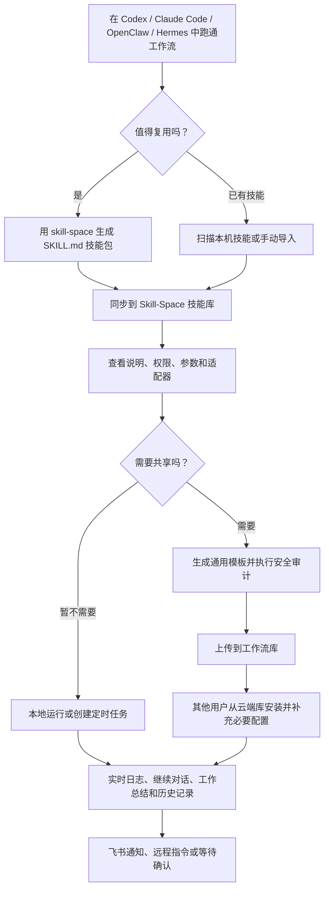

# Skill-Space

> 本地优先的 SkillOps 桌面工作台。把 Codex、Claude Code、OpenClaw、Hermes Agent 等 AI Agent 中可复用的工作流沉淀为通用 `SKILL.md` 技能，并统一管理、运行、对话、定时和移动端协同。
>
> A local-first SkillOps desktop workspace for turning reusable AI-agent workflows into portable `SKILL.md` skills, then managing, running, scheduling, publishing, and coordinating them visually.

<p align="center">
  
</p>

<p align="center">
  
  
  
  
</p>

<p align="center">
  <a href="https://github.com/lj1270998580-crypto/Skill-Space/releases/latest">Windows 安装包 / Windows Installer</a>
  ·
  <a href="AGENT_INSTALL.md">Agent 安装指南 / Agent Install Guide</a>
  ·
  <a href="docs/skill-space-blueprint.md">产品蓝图 / Blueprint</a>
</p>

---

## 中文

### 当前版本

- 最新版本：`0.1.35`
- GitHub Release：<https://github.com/lj1270998580-crypto/Skill-Space/releases/latest>
- Windows 安装包：`Skill-Space-Setup-0.1.35-x64.exe`
- 在线更新源：<https://ailabing.cn/downloads/skill-space/latest.yml>
- 默认执行器：Claude Code
- 默认权限模式：个人本地使用，`full`

### 0.1.35 更新重点

- 修复飞书消息路由：`执行第 6 个技能` 不再被误判为等待任务回复。
- 飞书回复改为更稳定的卡片分片发送，降低长消息截断和重复补发风险。
- 飞书运行诊断增强：用户询问失败、日志、原因时，会返回更具体的最近失败摘要。
- 修复 `exitCode=0` 且已输出完整报告的任务仍显示为失败或等待确认的问题。
- 发布工作流模板前增加安全审计：检查本机路径、明文密钥、账号和公众号等未模板化信息。
- 增加自动化 smoke tests：工作流库、飞书路由、模板安全、运行状态归一化。
- 保留并增强 LLM 管家、工作流库、飞书协同、后台守护、在线更新和本地技能管理能力。

### 核心能力

| 模块 | 能力 |
| --- | --- |
| 总览 | 查看本地技能工作台、最近技能、系统告警，并和 LLM 管家连续对话 |
| 技能库 | 扫描电脑已有技能、手动导入、收藏、搜索、单标签分类、自定义显示名 |
| 工作流库 | 在线刷新云端模板、区分已安装/云端库/已上传、安装模板、删除本地或云端模板 |
| 模板发布 | 将本地技能处理成通用模板，生成运行必填配置并做敏感信息审计 |
| 技能详情 | 查看 `SKILL.md`、workflow、权限、适配器、最近变更和运行入口 |
| LLM 修改技能 | 在技能详情中让 LLM 管家按要求修改 `SKILL.md` 并反馈修改结果 |
| 多 Agent 执行 | 支持 Claude Code、Codex CLI、OpenClaw、Hermes Agent 以及自定义 CLI 执行器 |
| 运行控制台 | 查看实时日志、运行历史、工作总结，并支持 Claude Code 继续对话 |
| 自动化 | 支持一次、每天、每周、每月和间隔触发 |
| 后台守护 | 通过 Windows Task Scheduler 静默检查到期任务，并在 UI 显示状态和错误 |
| 飞书通信 | 接收运行状态、远程发送任务、回复确认选项，并可由 LLM 管家理解意图 |
| 在线更新 | 从 `ailabing.cn` 的通用更新源检查、下载和安装新版 |

### 工作流



### 飞书协同

Skill-Space 的飞书模块用于手机端协作：

- 任务开始、完成、失败、等待确认时推送通知。
- 用户可在飞书直接回复选题、确认、补充要求。
- 普通聊天不会自动当成任务确认，多个等待任务时会要求指定任务。
- LLM 管家可理解自然语言，例如“为什么失败了”“现在有哪些技能”“帮我运行公众号技能”。
- 长消息会自动分片为卡片式回复，避免大段内容在飞书里难以阅读。

### 工作流库与模板安全

工作流库目标是让技能可以跨设备复用。上传前会尽量把本机信息改成模板变量：

- 路径：`{{path.workspace}}`
- 账号或项目名：`{{text.account_name}}`
- API Key、Token、Secret：`{{secret.api_key}}`
- 必要服务配置：写入模板的 required variables，安装后提醒用户补齐

发布前会做基础安全审计。如果发现疑似本机路径、明文密钥、账号或公众号名未模板化，模板会被标记为需要复核。

### 安装

#### 普通用户

1. 打开 [GitHub Releases](https://github.com/lj1270998580-crypto/Skill-Space/releases/latest)。
2. 下载 `Skill-Space-Setup-0.1.35-x64.exe` 或最新版本安装包。
3. 运行安装包，安装完成后从桌面或开始菜单打开 Skill-Space。

#### Agent 自动安装

把仓库地址交给 Agent：

```text
https://github.com/lj1270998580-crypto/Skill-Space
```

Agent 可参考 [AGENT_INSTALL.md](AGENT_INSTALL.md) 完成源码构建、安装包安装和内置技能同步。

### 本地存储

Skill-Space 默认优先使用本机数据目录。你可以在设置页修改本地存储根目录。保存后，应用会尝试把旧目录中的技能、运行记录、日志、自动化和配置迁移到新目录。

典型目录结构：

```text
Skill-Space/
  skills/
  runs/
  logs/
  artifacts/
  automations/
  marketplace/
  publish/
  registry/
  config/
```

### 开发

```powershell
git clone https://github.com/lj1270998580-crypto/Skill-Space.git
cd Skill-Space
npm install
npm run dev
```

常用命令：

```powershell
npm run typecheck
npm run test:all
npm run build
npm run dist:win
```

测试命令：

```powershell
npm run test:marketplace
npm run test:feishu
npm run test:safety
npm run test:run-status
```

### 发布

Windows 安装包和在线更新文件由 `electron-builder` 生成：

```text
release/Skill-Space-Setup-0.1.35-x64.exe
release/Skill-Space-Setup-0.1.35-x64.exe.blockmap
release/latest.yml
```

在线更新源目录：

```text
https://ailabing.cn/downloads/skill-space/
```

---

## English

### Current Version

- Latest version: `0.1.35`
- GitHub Release: <https://github.com/lj1270998580-crypto/Skill-Space/releases/latest>
- Windows installer: `Skill-Space-Setup-0.1.35-x64.exe`
- Auto-update feed: <https://ailabing.cn/downloads/skill-space/latest.yml>
- Default runner: Claude Code
- Default permission mode: local personal use, `full`

### What's New In 0.1.35

- Fixed Feishu routing so messages like `run the 6th skill` are no longer treated as waiting-task replies.
- Improved Feishu card replies and conservative message chunking to reduce truncation and duplicate fallback sends.
- Added better diagnostics when users ask why a run failed or request logs.
- Fixed completed `exitCode=0` runs with final reports being shown as failed or waiting for input.
- Added template publish safety checks for local paths, plaintext secrets, accounts, and public-account names.
- Added smoke tests for the workflow marketplace, Feishu routing, publish safety, and run-status normalization.

### Features

| Area | Capability |
| --- | --- |
| Dashboard | Local SkillOps overview, recent skills, system alerts, and persistent LLM steward chat |
| Skills | Scan local skills, import packages, search, favorite, classify by one tag, and assign display names |
| Workflow Library | Refresh remote templates, separate installed/cloud/uploaded views, install templates, and delete local or uploaded templates |
| Template Publishing | Convert local skills into reusable templates with required configuration and safety review |
| Details | Inspect `SKILL.md`, workflow, schemas, permissions, adapters, recent changes, and run controls |
| LLM Skill Editing | Ask the steward to revise the selected `SKILL.md` directly |
| Multi-Agent Runtime | Run skills with Claude Code, Codex CLI, OpenClaw, Hermes Agent, or custom CLI runners |
| Run Console | Live logs, run history, structured run summaries, and Claude Code follow-up conversations |
| Automation | One-time, daily, weekly, monthly, and interval schedules |
| Background Scheduler | Silent Windows Task Scheduler integration with visible status and error reporting |
| Feishu Messaging | Mobile notifications, remote commands, confirmation replies, and LLM intent routing |
| Online Updates | Generic update feed hosted on `ailabing.cn` |

### Install

1. Open [GitHub Releases](https://github.com/lj1270998580-crypto/Skill-Space/releases/latest).
2. Download `Skill-Space-Setup-0.1.35-x64.exe` or the latest installer.
3. Run the installer and launch Skill-Space from the desktop or Start Menu.

### Development

```powershell
git clone https://github.com/lj1270998580-crypto/Skill-Space.git
cd Skill-Space
npm install
npm run dev
```

Build and package:

```powershell
npm run typecheck
npm run test:all
npm run build
npm run dist:win
```

## License

Apache-2.0. See [LICENSE](LICENSE).
